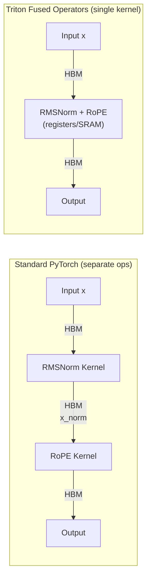
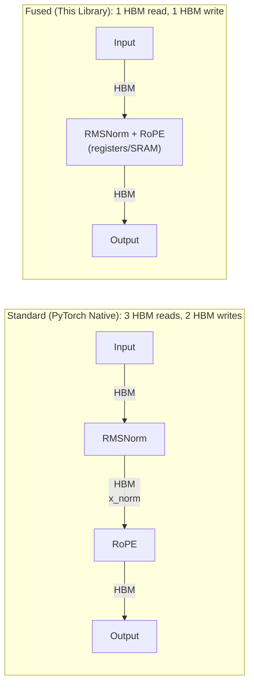

# Triton Fused Operators

<div align="center">

[](https://github.com/LessUp/triton-fused-ops/actions/workflows/ci.yml)
[](https://lessup.github.io/triton-fused-ops/)
[](LICENSE)


**Drop-in optimized kernels for LLM inference. Zero accuracy loss, up to 3x speedup.**

[📖 Docs](https://lessup.github.io/triton-fused-ops/) | [🇨🇳 中文](README.zh-CN.md) | [💡 Examples](examples/) | [🧪 Benchmarks](tests/benchmarks/) | [🤝 Contributing](CONTRIBUTING.md)

</div>

---

## The Problem

Transformer inference is **memory-bound**, not compute-bound.



| Approach | HBM Access | Bandwidth Utilization |
|:---------|:----------:|:---------------------:|
| Standard PyTorch | 3 reads + 2 writes per token | ~30-40% |
| **Triton Fused** | **1 read + 1 write per token** | **90%+** |

**Result:** 1.5-3x faster inference, especially for large batch sizes where HBM bandwidth is the bottleneck.

---

## Features

| Operator | Fusion Strategy | Speedup | Memory Saved |
|:---------|:----------------|:-------:|:------------:|
| `fused_rmsnorm_rope` | RMSNorm + RoPE in one kernel | **~3x** | 50% fewer HBM writes |
| `fused_gated_mlp` | Gate & Up projection + SiLU/GELU | **~1.5x** | 1 fewer intermediate tensor |
| `fp8_gemm` | FP8 matmul with dynamic scaling | **~1.4x** | **50%** weight storage |

### Key Capabilities

- ✅ **Drop-in replacement** — No model architecture changes needed
- ✅ **Framework compatible** — Works with HuggingFace, PyTorch, vLLM, TGI
- ✅ **Verified accuracy** — Numerically validated against PyTorch reference
- ✅ **FP8 overflow handling** — Automatic detection and recovery (<0.5% error)
- ✅ **GPU auto-tuning** — Automatic optimization for your specific GPU
- ✅ **Comprehensive benchmarks** — Performance and correctness verification tools

---

## Quick Start

### Prerequisites

- **GPU:** NVIDIA Ampere (A100, RTX 30xx) or newer recommended
- **CUDA:** Version 11.8 or higher (12.1+ preferred)
- **Python:** 3.9 or higher
- **PyTorch:** 2.0 or higher
- **Triton:** 2.1 or higher

### Installation

```bash
# Clone the repository
git clone https://github.com/LessUp/triton-fused-ops.git
cd triton-fused-ops

# Development installation (recommended)
pip install -e ".[dev]"

# Or install core dependencies only
pip install -e .
```

**Note:** The package is not yet published on PyPI. Use the development installation above.

### Verify Installation

```bash
python -c "from triton_ops import fused_rmsnorm_rope; print('✓ Installation successful')"
```

### Basic Usage

```python
import torch
from triton_ops import fused_rmsnorm_rope, fused_gated_mlp, fp8_gemm

# Before: 2 separate kernel launches, intermediate tensors in HBM
# x_norm = rmsnorm(x); output = rope(x_norm, cos, sin)

# After: 1 fused kernel, no intermediate HBM write
output = fused_rmsnorm_rope(x, weight, cos, sin)
```

### Build an Optimized Transformer

```python
import torch
from triton_ops import FusedRMSNormRoPE, FusedGatedMLP, FP8Linear

class LlamaDecoderLayer(torch.nn.Module):
    """Optimized Llama-style decoder with fused kernels."""
    
    def __init__(self, hidden_dim=4096, num_heads=32, intermediate_dim=11008):
        super().__init__()
        head_dim = hidden_dim // num_heads
        
        # Fused RMSNorm + RoPE replaces 2 separate ops
        self.input_norm = FusedRMSNormRoPE(hidden_dim, head_dim)
        
        # Fused Gated MLP: SwiGLU in single kernel
        self.mlp = FusedGatedMLP(hidden_dim, intermediate_dim, activation='silu')
        
        # FP8 quantized linear for 50% memory savings
        self.q_proj = FP8Linear(hidden_dim, hidden_dim)
        self.k_proj = FP8Linear(hidden_dim, hidden_dim)
        self.v_proj = FP8Linear(hidden_dim, hidden_dim)
        self.o_proj = FP8Linear(hidden_dim, hidden_dim)
    
    def forward(self, x, cos, sin):
        # Pre-norm with fused RoPE
        normed = self.input_norm(x, cos, sin)
        
        # Attention (your impl or flash-attn)
        q = self.q_proj(normed)
        k = self.k_proj(normed)
        v = self.v_proj(normed)
        attn_out = flash_attn(q, k, v)  # or your attention
        
        # Post-attention + MLP
        x = x + self.o_proj(attn_out)
        x = x + self.mlp(x)
        return x
```

### FP8 Quantization

```python
from triton_ops import quantize_fp8, fp8_gemm

# Dynamic scaling — automatic range detection
tensor = torch.randn(1024, 4096, device='cuda', dtype=torch.float16)
quantized, scale = quantize_fp8(tensor)
# Scale formula: max_abs / 448.0 (448 is FP8 E4M3 max value)

# FP8 GEMM with FP32 accumulation for numerical stability
a_fp8, a_scale = quantize_fp8(a)
b_fp8, b_scale = quantize_fp8(b)
output = fp8_gemm(a_fp8, b_fp8, a_scale, b_scale)  # Returns FP16
```

---

## Benchmarks

Tested on NVIDIA A100 80GB, CUDA 12.1.

### RMSNorm + RoPE Fusion

| Batch | Seq Len | Hidden | PyTorch (separate) | Fused | **Speedup** | Bandwidth |
|:-----:|:-------:|:------:|:------------------:|:-----:|:-----------:|:---------:|
| 1 | 2048 | 4096 | 0.38 ms | 0.12 ms | **3.2x** | 91 GB/s |
| 4 | 2048 | 4096 | 1.42 ms | 0.45 ms | **3.2x** | 93 GB/s |
| 8 | 2048 | 4096 | 2.81 ms | 0.89 ms | **3.2x** | 94 GB/s |
| 16 | 4096 | 4096 | 11.2 ms | 3.52 ms | **3.2x** | 94 GB/s |

> 💡 **Why 3x?** Memory bandwidth is fully utilized (90%+ vs 30-40% unfused). Each token's data only travels through HBM once.

### FP8 vs FP16 GEMM

| Matrix Size | FP16 (TFLOPS) | FP8 (TFLOPS) | **Speedup** | Memory |
|:-----------:|:-------------:|:------------:|:-----------:|:------:|
| 1024² | 98 | 138 | **1.4x** | 50% |
| 2048² | 156 | 218 | **1.4x** | 50% |
| 4096² | 198 | 276 | **1.4x** | 50% |

| Precision | MMLU Acc | Max Value | Use Case |
|:----------|:--------:|:---------:|:---------|
| FP16 | 42.1% | 65504 | Training |
| **FP8** | **41.9%** (-0.2%) | 448 | **Inference** |

---

## Documentation

- [Installation Guide](https://lessup.github.io/triton-fused-ops/docs/en/getting-started/installation.html)
- [Quick Start](https://lessup.github.io/triton-fused-ops/docs/en/getting-started/quickstart.html)
- [API Reference](https://lessup.github.io/triton-fused-ops/docs/en/api/kernels.html)
- [Integration Guide](https://lessup.github.io/triton-fused-ops/docs/en/guides/integration.html)

---

## API Reference

### Functions

| Function | Signature | Description |
|:---------|:----------|:------------|
| `fused_rmsnorm_rope` | `(x, weight, cos, sin, eps=1e-6, num_heads=None)` → `Tensor` | RMSNorm + RoPE fusion |
| `fused_gated_mlp` | `(x, gate_weight, up_weight, activation='silu')` → `Tensor` | SwiGLU/GeGLU fusion |
| `fp8_gemm` | `(a, b, a_scale=None, b_scale=None, output_dtype=torch.float16)` → `Tensor` | Quantized matmul |
| `quantize_fp8` | `(tensor, scale=None)` → `(Tensor, scale)` | E4M3 quantization |
| `dequantize_fp8` | `(tensor, scale, dtype=torch.float16)` → `Tensor` | E4M3 dequantization |

### Modules

| Class | `__init__` | Forward |
|:------|:-----------|:--------|
| `FusedRMSNormRoPE` | `(hidden_dim, head_dim, eps=1e-6)` | `(x, cos, sin)` → `x` |
| `FusedGatedMLP` | `(hidden_dim, intermediate_dim, activation='silu')` | `(x)` → `x` |
| `FP8Linear` | `(in_features, out_features, bias=False)` | `(x)` → `x` |

See [📖 Full API Docs](https://lessup.github.io/triton-fused-ops/) for detailed signatures.

---

## Project Structure

```
triton_ops/
├── kernels/           # Triton implementations
│   ├── rmsnorm_rope.py      # Fused norm + position encoding
│   ├── gated_mlp.py         # Fused SwiGLU/GeGLU
│   ├── fp8_gemm.py          # Quantized matmul
│   └── fp8_quantize.py      # Quantization primitives
├── autotuner/         # Automatic optimization
│   ├── tuner.py             # Config search framework
│   ├── configs.py           # Hardware config spaces
│   └── cache.py             # Persistent tuning cache
├── benchmark/         # Testing & validation
│   ├── suite.py             # Benchmark orchestration
│   ├── correctness.py       # Numerical verification
│   └── report.py            # Performance reports
└── api.py             # Clean user-facing API
```

---

## Testing

```bash
# Run all tests
pytest tests/ -v

# Run with coverage
pytest tests/ -v --cov=triton_ops

# Property-based testing (Hypothesis)
pytest tests/ --hypothesis-profile=ci

# Run benchmarks
python -m tests.benchmarks.bench_rmsnorm_rope
python -m tests.benchmarks.bench_gated_mlp
python -m tests.benchmarks.bench_fp8_gemm
```

---

## Use Cases

| Use Case | Solution | Benefit |
|:---------|:---------|:--------|
| **vLLM / TGI integration** | Replace attention preprocessing | 2-3x prefill improvement |
| **LLaMA/Mistral fine-tuning** | Fused MLP during forward | 20% faster training step |
| **Edge deployment (Jetson)** | FP8 weights | Run 7B models on 16GB |
| **Batch inference service** | Kernel fusion + FP8 | 2x throughput, 50% cost |

---

## Technical Deep Dive

### Kernel Fusion Strategy



### FP8 E4M3 Format Details

- **1 sign bit, 4 exponent bits, 3 mantissa bits**
- **Max representable:** 448.0
- **Dynamic scaling:** `scale = max_abs(tensor) / 448.0`
- **Overflow detection:** Automatic retry with adjusted scale

### Hardware Support

| GPU Architecture | FP16 | FP8 | Best For |
|:----------------|:----:|:---:|:---------|
| Ampere (A100) | ✅ | ⚠️ emu | Production inference |
| Ada (RTX 4090) | ✅ | ✅ | Edge deployment |
| Hopper (H100) | ✅ | ✅ | Large-scale serving |

> **Note:** FP8 on Ampere uses emulation; native FP8 support requires Ada/Hopper.

---

## Troubleshooting

### Installation Issues

| Issue | Solution |
|:------|:---------|
| `ImportError: No module named triton` | Install Triton: `pip install triton>=2.1.0` |
| `CUDA_ERROR_NO_DEVICE` | Verify CUDA is available: `torch.cuda.is_available()` |
| `RuntimeError: CUDA out of memory` | Reduce batch size or enable FP8 quantization |
| `Compilation error` | Ensure CUDA toolkit matches PyTorch CUDA version |

### Performance Issues

| Symptom | Likely Cause | Solution |
|:--------|:-------------|:---------|
| No speedup observed | Small batch size | Fusion benefits grow with batch size; test with batch ≥ 4 |
| Slower than PyTorch | GPU not utilized | Check `nvidia-smi` and ensure inputs are on CUDA |
| Bandwidth < 80% | Wrong kernel config | Run auto-tuner first: `TritonAutoTuner().optimize(...)` |
| FP8 accuracy issues | Scale overflow | Check input max values are within FP8 range (< 448) |

### Verification Steps

```python
# 1. Check GPU availability
import torch
print(f"CUDA available: {torch.cuda.is_available()}")
print(f"GPU: {torch.cuda.get_device_name(0)}")

# 2. Verify basic operation
from triton_ops import fused_rmsnorm_rope
x = torch.randn(2, 128, 4096, device='cuda', dtype=torch.float16)
weight = torch.ones(4096, device='cuda', dtype=torch.float16)
cos = torch.randn(128, 64, device='cuda', dtype=torch.float16)
sin = torch.randn(128, 64, device='cuda', dtype=torch.float16)
out = fused_rmsnorm_rope(x, weight, cos, sin)
print(f"Output shape: {out.shape} ✓")

# 3. Run correctness check
from triton_ops import quantize_fp8, dequantize_fp8
tensor = torch.randn(1024, 1024, device='cuda', dtype=torch.float16)
quantized, scale = quantize_fp8(tensor)
recovered = dequantize_fp8(quantized, scale)
error = torch.abs(tensor - recovered).mean().item()
print(f"FP8 reconstruction error: {error:.6f} ✓")
```

---

## Contributing

```bash
# Setup
git clone https://github.com/LessUp/triton-fused-ops.git
cd triton-fused-ops
pip install -e ".[dev]"

# Test
pytest tests/ -v

# Code style
black triton_ops/ tests/
ruff check --fix triton_ops/ tests/
mypy triton_ops/
```

See [CONTRIBUTING.md](CONTRIBUTING.md) for detailed guidelines.

---

## License

MIT — free for commercial and research use.

---

## Acknowledgments

Built with [OpenAI Triton](https://github.com/openai/triton) and inspired by [FlashAttention](https://github.com/Dao-AILab/flash-attention)'s memory-efficient kernels.

---

<div align="center">

**[Back to Top](#triton-fused-operators)**

Star ⭐ if this helps your LLM deployment!

</div>
