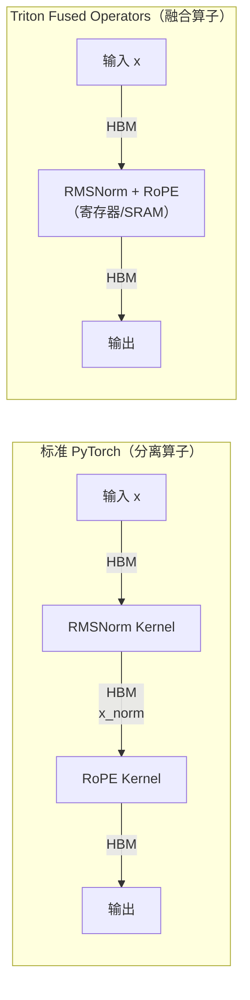
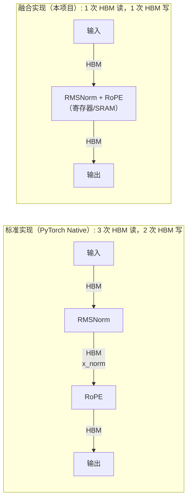

# Triton Fused Operators — 高性能 GPU 算子融合库

<div align="center">

[](https://github.com/LessUp/triton-fused-ops/actions/workflows/ci.yml)
[](https://lessup.github.io/triton-fused-ops/)
[](LICENSE)


**一行代码，让 LLM 推理速度提升 3 倍，零精度损失。**

[📖 文档](https://lessup.github.io/triton-fused-ops/) | [🇺🇸 English](README.md) | [💡 示例](examples/) | [🧪 基准测试](tests/benchmarks/) | [🤝 贡献代码](CONTRIBUTING.md)

</div>

---

## 问题所在

Transformer 推理受限于**内存带宽**，而非计算能力。



| 方案 | HBM 访问 | 带宽利用率 |
|:-----|:--------:|:----------:|
| 标准 PyTorch | 每个 token 3 次读 + 2 次写 | ~30-40% |
| **Triton 融合** | **每个 token 1 次读 + 1 次写** | **90%+** |

**结果：** 推理速度提升 1.5-3 倍，尤其在大 batch 场景下 HBM 带宽是瓶颈时效果明显。

---

## 功能特性

| 算子 | 融合策略 | 加速比 | 内存节省 |
|:---------|:----------------|:-------:|:------------:|
| `fused_rmsnorm_rope` | RMSNorm + RoPE 单 kernel | **~3x** | HBM 写入减少 50% |
| `fused_gated_mlp` | Gate & Up 投影 + SiLU/GELU | **~1.5x** | 减少 1 个中间张量 |
| `fp8_gemm` | FP8 矩阵乘法 + 动态缩放 | **~1.4x** | **50%** 权重存储 |

### 核心能力

- ✅ **即插即用** — 无需改动模型结构，直接替换现有算子
- ✅ **框架兼容** — 支持 HuggingFace、PyTorch、vLLM、TGI
- ✅ **精度验证** — 数值精度通过与 PyTorch 参考实现验证
- ✅ **FP8 溢出处理** — 自动检测和恢复（误差 <0.5%）
- ✅ **GPU 自动调优** — 针对特定 GPU 自动优化
- ✅ **完整基准测试** — 性能和正确性验证工具

---

## 快速开始

### 环境要求

- **GPU:** NVIDIA Ampere (A100, RTX 30xx) 或更新架构（推荐）
- **CUDA:** 11.8 或更高版本（推荐 12.1+）
- **Python:** 3.9 或更高版本
- **PyTorch:** 2.0 或更高版本
- **Triton:** 2.1 或更高版本

### 安装

```bash
# 克隆仓库
git clone https://github.com/LessUp/triton-fused-ops.git
cd triton-fused-ops

# 开发模式安装（推荐）
pip install -e ".[dev]"

# 或仅安装核心依赖
pip install -e .
```

**注意：** 本包尚未发布到 PyPI，请使用上述开发模式安装。

### 验证安装

```bash
python -c "from triton_ops import fused_rmsnorm_rope; print('✓ 安装成功')"
```

### 基础用法

```python
import torch
from triton_ops import fused_rmsnorm_rope, fused_gated_mlp, fp8_gemm

# 之前：2 次 kernel 启动，中间结果写入 HBM
# x_norm = rmsnorm(x); output = rope(x_norm, cos, sin)

# 现在：1 次融合 kernel，无中间 HBM 写入
output = fused_rmsnorm_rope(x, weight, cos, sin)
```

### 构建优化的 Transformer

```python
import torch
from triton_ops import FusedRMSNormRoPE, FusedGatedMLP, FP8Linear

class LlamaDecoderLayer(torch.nn.Module):
    """使用融合算子优化的 Llama 风格 Decoder"""
    
    def __init__(self, hidden_dim=4096, num_heads=32, intermediate_dim=11008):
        super().__init__()
        head_dim = hidden_dim // num_heads
        
        # 融合 RMSNorm + RoPE，替代 2 个分离算子
        self.input_norm = FusedRMSNormRoPE(hidden_dim, head_dim)
        
        # 融合 Gated MLP：单 kernel 完成 SwiGLU
        self.mlp = FusedGatedMLP(hidden_dim, intermediate_dim, activation='silu')
        
        # FP8 量化线性层，节省 50% 显存
        self.q_proj = FP8Linear(hidden_dim, hidden_dim)
        self.k_proj = FP8Linear(hidden_dim, hidden_dim)
        self.v_proj = FP8Linear(hidden_dim, hidden_dim)
        self.o_proj = FP8Linear(hidden_dim, hidden_dim)
    
    def forward(self, x, cos, sin):
        # Pre-norm 融合 RoPE
        normed = self.input_norm(x, cos, sin)
        
        # Attention（可用 flash-attn 或自研实现）
        q = self.q_proj(normed)
        k = self.k_proj(normed)
        v = self.v_proj(normed)
        attn_out = flash_attn(q, k, v)
        
        # Post-attention + MLP
        x = x + self.o_proj(attn_out)
        x = x + self.mlp(x)
        return x
```

### FP8 量化

```python
from triton_ops import quantize_fp8, fp8_gemm

# 动态缩放 — 自动范围检测
tensor = torch.randn(1024, 4096, device='cuda', dtype=torch.float16)
quantized, scale = quantize_fp8(tensor)
# 缩放公式：max_abs / 448.0（448 是 FP8 E4M3 最大值）

# FP8 GEMM，FP32 累加保证数值稳定性
a_fp8, a_scale = quantize_fp8(a)
b_fp8, b_scale = quantize_fp8(b)
output = fp8_gemm(a_fp8, b_fp8, a_scale, b_scale)  # 返回 FP16
```

---

## 性能基准

在 NVIDIA A100 80GB、CUDA 12.1 上测试。

### RMSNorm + RoPE 融合

| Batch | 序列长度 | Hidden | PyTorch (分离) | 融合算子 | **加速比** | 带宽利用率 |
|:-----:|:-------:|:------:|:--------------:|:-------:|:----------:|:---------:|
| 1 | 2048 | 4096 | 0.38 ms | 0.12 ms | **3.2x** | 91 GB/s |
| 4 | 2048 | 4096 | 1.42 ms | 0.45 ms | **3.2x** | 93 GB/s |
| 8 | 2048 | 4096 | 2.81 ms | 0.89 ms | **3.2x** | 94 GB/s |
| 16 | 4096 | 4096 | 11.2 ms | 3.52 ms | **3.2x** | 94 GB/s |

> 💡 **为什么是 3 倍？** 内存带宽被充分利用（90%+ vs 分离实现的 30-40%）。每个 token 的数据只需经过 HBM 一次。

### FP8 vs FP16 GEMM

| 矩阵大小 | FP16 (TFLOPS) | FP8 (TFLOPS) | **加速比** | 内存占用 |
|:-------:|:-------------:|:-----------:|:----------:|:--------:|
| 1024² | 98 | 138 | **1.4x** | 50% |
| 2048² | 156 | 218 | **1.4x** | 50% |
| 4096² | 198 | 276 | **1.4x** | 50% |

| 精度 | MMLU 准确率 | 最大值 | 适用场景 |
|:-----|:----------:|:------:|:---------|
| FP16 | 42.1% | 65504 | 训练 |
| **FP8** | **41.9%** (-0.2%) | 448 | **推理** |

---

## 文档

- [安装指南](https://lessup.github.io/triton-fused-ops/docs/en/getting-started/installation.html)
- [快速开始](https://lessup.github.io/triton-fused-ops/docs/en/getting-started/quickstart.html)
- [API 参考](https://lessup.github.io/triton-fused-ops/docs/en/api/kernels.html)
- [集成指南](https://lessup.github.io/triton-fused-ops/docs/en/guides/integration.html)

---

## API 参考

### 函数式 API

| 函数 | 签名 | 说明 |
|:---------|:----------|:------------|
| `fused_rmsnorm_rope` | `(x, weight, cos, sin, eps=1e-6, num_heads=None)` → `Tensor` | RMSNorm + RoPE 融合 |
| `fused_gated_mlp` | `(x, gate_weight, up_weight, activation='silu')` → `Tensor` | SwiGLU/GeGLU 融合 |
| `fp8_gemm` | `(a, b, a_scale=None, b_scale=None, output_dtype=torch.float16)` → `Tensor` | 量化矩阵乘法 |
| `quantize_fp8` | `(tensor, scale=None)` → `(Tensor, scale)` | E4M3 量化 |
| `dequantize_fp8` | `(tensor, scale, dtype=torch.float16)` → `Tensor` | E4M3 反量化 |

### Module API

| 类 | `__init__` | Forward |
|:------|:-----------|:--------|
| `FusedRMSNormRoPE` | `(hidden_dim, head_dim, eps=1e-6)` | `(x, cos, sin)` → `x` |
| `FusedGatedMLP` | `(hidden_dim, intermediate_dim, activation='silu')` | `(x)` → `x` |
| `FP8Linear` | `(in_features, out_features, bias=False)` | `(x)` → `x` |

详见 [📖 完整 API 文档](https://lessup.github.io/triton-fused-ops/)

---

## 项目结构

```
triton_ops/
├── kernels/           # Triton 实现
│   ├── rmsnorm_rope.py      # 融合的归一化 + 位置编码
│   ├── gated_mlp.py         # 融合的 SwiGLU/GeGLU
│   ├── fp8_gemm.py          # 量化矩阵乘法
│   └── fp8_quantize.py      # 量化原语
├── autotuner/         # 自动优化
│   ├── tuner.py             # 配置搜索框架
│   ├── configs.py           # 硬件配置空间
│   └── cache.py             # 持久化调优缓存
├── benchmark/         # 测试与验证
│   ├── suite.py             # 基准测试编排
│   ├── correctness.py       # 数值验证
│   └── report.py            # 性能报告
└── api.py             # 简洁的用户 API
```

---

## 测试

```bash
# 运行所有测试
pytest tests/ -v

# 运行覆盖率测试
pytest tests/ -v --cov=triton_ops

# 基于属性的测试（Hypothesis）
pytest tests/ --hypothesis-profile=ci

# 运行基准测试
python -m tests.benchmarks.bench_rmsnorm_rope
python -m tests.benchmarks.bench_gated_mlp
python -m tests.benchmarks.bench_fp8_gemm
```

---

## 应用场景

| 场景 | 解决方案 | 收益 |
|:-----|:---------|:-----|
| **vLLM / TGI 集成** | 替换 attention 预处理 | prefill 阶段提速 2-3 倍 |
| **LLaMA/Mistral 微调** | 训练时启用融合 MLP | 每步提速 20% |
| **边缘部署 (Jetson)** | FP8 权重 | 16GB 显存运行 7B 模型 |
| **批处理推理服务** | 算子融合 + FP8 | 吞吐量翻倍，成本减半 |

---

## 技术深度解析

### 算子融合策略



### FP8 E4M3 格式详情

- **1 符号位，4 指数位，3 尾数位**
- **最大可表示值：** 448.0
- **动态缩放：** `scale = max_abs(tensor) / 448.0`
- **溢出检测：** 自动重试并调整 scale

### 硬件支持

| GPU 架构 | FP16 | FP8 | 最佳场景 |
|:--------|:----:|:---:|:---------|
| Ampere (A100) | ✅ | ⚠️ 模拟 | 生产级推理 |
| Ada (RTX 4090) | ✅ | ✅ | 边缘部署 |
| Hopper (H100) | ✅ | ✅ | 大规模服务 |

> **注意：** Ampere 架构上的 FP8 使用模拟实现；原生 FP8 支持需要 Ada/Hopper 架构。

---

## 故障排查

### 安装问题

| 问题 | 解决方案 |
|:-----|:---------|
| `ImportError: No module named triton` | 安装 Triton: `pip install triton>=2.1.0` |
| `CUDA_ERROR_NO_DEVICE` | 验证 CUDA 可用性: `torch.cuda.is_available()` |
| `RuntimeError: CUDA out of memory` | 减小 batch size 或启用 FP8 量化 |
| `Compilation error` | 确保 CUDA toolkit 版本与 PyTorch CUDA 版本匹配 |

### 性能问题

| 现象 | 可能原因 | 解决方案 |
|:-----|:---------|:---------|
| 无加速效果 | batch 太小 | 融合优势随 batch 增大；测试 batch ≥ 4 |
| 比 PyTorch 慢 | GPU 未充分利用 | 检查 `nvidia-smi` 并确保输入在 CUDA 上 |
| 带宽 < 80% | kernel 配置不当 | 先运行自动调优: `TritonAutoTuner().optimize(...)` |
| FP8 精度问题 | 缩放溢出 | 检查输入最大值在 FP8 范围内（< 448） |

### 验证步骤

```python
# 1. 检查 GPU 可用性
import torch
print(f"CUDA 可用: {torch.cuda.is_available()}")
print(f"GPU: {torch.cuda.get_device_name(0)}")

# 2. 验证基本运算
from triton_ops import fused_rmsnorm_rope
x = torch.randn(2, 128, 4096, device='cuda', dtype=torch.float16)
weight = torch.ones(4096, device='cuda', dtype=torch.float16)
cos = torch.randn(128, 64, device='cuda', dtype=torch.float16)
sin = torch.randn(128, 64, device='cuda', dtype=torch.float16)
out = fused_rmsnorm_rope(x, weight, cos, sin)
print(f"输出形状: {out.shape} ✓")

# 3. 运行正确性检查
from triton_ops import quantize_fp8, dequantize_fp8
tensor = torch.randn(1024, 1024, device='cuda', dtype=torch.float16)
quantized, scale = quantize_fp8(tensor)
recovered = dequantize_fp8(quantized, scale)
error = torch.abs(tensor - recovered).mean().item()
print(f"FP8 重建误差: {error:.6f} ✓")
```

---

## 贡献代码

```bash
# 环境配置
git clone https://github.com/LessUp/triton-fused-ops.git
cd triton-fused-ops
pip install -e ".[dev]"

# 测试
pytest tests/ -v

# 代码规范
black triton_ops/ tests/
ruff check --fix triton_ops/ tests/
mypy triton_ops/
```

详见 [CONTRIBUTING.md](CONTRIBUTING.md)

---

## 许可证

MIT —— 可自由用于商业和学术研究。

---

## 致谢

基于 [OpenAI Triton](https://github.com/openai/triton) 构建，灵感源自 [FlashAttention](https://github.com/Dao-AILab/flash-attention) 的内存高效 kernel。

---

<div align="center">

**[回到顶部](#triton-fused-operators--高性能-gpu-算子融合库)**

如果这个项目对你有帮助，请点个 ⭐

</div>
