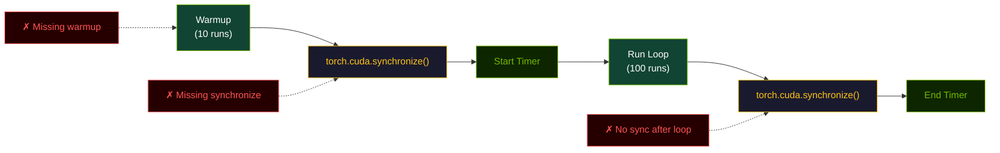

# Performance Tuning

This page explains how to measure the shipped kernels correctly and how to reason about tuning work around them. The fusion optimization philosophy draws on IO-aware scheduling principles from FlashAttention [1].

## Start with the right question

The repository contains three different performance stories:

- `fused_rmsnorm_rope`: primarily a memory-traffic reduction story,
- `fused_gated_mlp`: a fusion and launch-overhead reduction story,
- `fp8_gemm`: a quantization plus matrix-multiplication throughput story.

Treat them differently when benchmarking.

## Correct timing pattern

```python
import time
import torch
from triton_ops import fused_rmsnorm_rope

x = torch.randn(8, 2048, 4096, device="cuda", dtype=torch.float16)
weight = torch.ones(4096, device="cuda", dtype=torch.float16)
cos = torch.randn(2048, 64, device="cuda", dtype=torch.float16)
sin = torch.randn(2048, 64, device="cuda", dtype=torch.float16)

for _ in range(10):
    _ = fused_rmsnorm_rope(x, weight, cos, sin)
torch.cuda.synchronize()

start = time.perf_counter()
for _ in range(100):
    _ = fused_rmsnorm_rope(x, weight, cos, sin)
torch.cuda.synchronize()
end = time.perf_counter()

print((end - start) / 100 * 1000)
```

Always include:

- warmup runs,
- explicit synchronization before and after timing,
- representative shapes from your target model.

### Timing pattern diagram



> **Figure 6.** Correct GPU timing pattern. Warmup (green) primes caches and kernels. Synchronization (yellow) is mandatory before and after the measured region. Common errors (red) invalidate timing results.

## Use the built-in benchmark layer when possible

`BenchmarkSuite` already wraps warmup, repeated execution, correctness verification, and report generation.

Use it when you want comparable outputs across multiple experiments.

## Interpreting metrics

Use `PerformanceProfile` to compute derived metrics:

```python
from triton_ops import PerformanceProfile

# Computational throughput for GEMM-like work
gemm_profile = PerformanceProfile.gemm(M=1024, N=4096, K=4096)
metrics = gemm_profile.metrics(latency_ms=0.5)
print(f"Throughput: {metrics.throughput_tflops:.2f} TFLOPS")

# Effective bandwidth for elementwise or reduction-heavy kernels
elem_profile = PerformanceProfile.elementwise(numel=1024*4096)
metrics = elem_profile.metrics(latency_ms=0.1)
print(f"Bandwidth utilization: {metrics.bandwidth_utilization:.1f}%")
```

Use these to distinguish between:

- computational throughput for GEMM-like work,
- effective bandwidth for elementwise or reduction-heavy kernels.

## Tuning custom kernels

`TritonAutoTuner` is useful when you own a custom kernel wrapper and want to search configuration space over:

- block sizes,
- warp counts,
- other keyword-parameterized launch choices.

The shipped kernel entry points do not automatically search config space during normal calls.

## Practical bottleneck checklist

### For `fused_rmsnorm_rope`

- check that RoPE cache shapes are correct and contiguous,
- keep hidden dimensions aligned with the head layout,
- treat memory traffic as the primary optimization target.

### For `fused_gated_mlp`

- benchmark on realistic intermediate dimensions,
- evaluate activation choice explicitly,
- remember that a full FFN includes additional surrounding work not measured by this kernel alone.

### For `fp8_gemm`

- compare auto-quantization against explicit pre-quantization,
- validate the numerical error against an FP16 baseline,
- benchmark representative matrix aspect ratios rather than only square matrices.

## What not to trust blindly

- A single GPU architecture result does not generalize to every deployment target.
- A benchmark without synchronization is not meaningful.
- A latency improvement on isolated kernels does not automatically translate into identical end-to-end model speedup.

## References

1. Dao, T., et al. (2022). FlashAttention: Fast and Memory-Efficient Exact Attention with IO-Awareness. *NeurIPS*. [arXiv:2205.14135](https://arxiv.org/abs/2205.14135)
2. Williams, S., Waterman, A., & Patterson, D. (2009). Roofline: An Insightful Visual Performance Model for Floating-Point Programs and Multicore Architectures. *Communications of the ACM*.

See the full [References](/en/references/papers) page for more papers and [Benchmark Visualization](/en/guides/benchmark-visualization) for visual performance comparisons.
