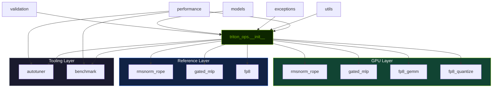

# Architecture

The repository is organized around a small public API layer backed by validation helpers, Triton kernel implementations, performance tooling, and shared data models.

## Module map

```text
triton_ops/
├── __init__.py          # root public exports
├── performance.py       # PerformanceProfile — derived metrics seam
├── models.py            # dataclasses and metric/result containers
├── exceptions.py        # custom exception types
├── validation.py        # runtime input checks
├── utils.py             # shared helpers and constants
├── kernels/
│   ├── rmsnorm_rope.py
│   ├── gated_mlp.py
│   ├── fp8_gemm.py
│   └── fp8_quantize.py
├── reference/           # CPU/GPU reference implementations
│   ├── rmsnorm_rope.py
│   ├── gated_mlp.py
│   └── fp8.py
├── autotuner/
│   ├── configs.py
│   ├── tuner.py
│   └── cache.py
└── benchmark/
    ├── correctness.py
    ├── report.py
    └── suite.py
```

## Module dependency diagram



> **Figure 1.** Module dependency graph. GPU-layer kernels (green) and reference implementations (blue) are independently exported from the root package. References are used for correctness verification and CPU testing but are not imported by GPU kernels at runtime. The tooling layer (gray) consumes `performance` metrics independently.

## Call chain


> **Figure 2.** Runtime call chain. Validation (yellow) acts as a gate before any GPU work is launched. The Triton kernel reads from and writes to HBM only at the boundaries.

## Responsibility split

### Public API layer

`triton_ops.__init__` is the primary public surface. It exports kernels, module wrappers, quantization helpers, benchmark classes, autotuning tools, dataclasses, exception types, and `PerformanceProfile`. The root package is the only user-facing entry point.

### Performance metrics seam

`triton_ops.performance` provides `PerformanceProfile` objects that encapsulate problem-shape context for computing derived metrics (throughput TFLOPS, bandwidth GB/s, utilization). Used by both `BenchmarkSuite` and as an optional enrichment layer for autotuner results.

Three constructors: `latency_only()`, `elementwise(numel, ...)`, `gemm(M, N, K, ...)`.

### Reference implementation layer

`triton_ops.reference` provides reference implementations mathematically equivalent to the Triton kernels, supporting both CPU (NumPy) and GPU (PyTorch) backends. These are importable without GPU hardware and serve as:

- correctness references for kernel verification,
- test targets for unit testing without GPU (using `backend='cpu'`),
- documentation of the exact mathematical formulas.

References are exported from the root package (e.g., `reference_rmsnorm`, `reference_rope`) but are not imported by GPU kernels at runtime.

### Validation layer

`validation.py` centralizes input contracts:

- device placement,
- dtype support,
- contiguity,
- shape compatibility,
- scalar parameter checks.

This keeps the kernel entry points smaller and makes the constraints reusable in tests and wrappers.

### Kernel layer

The `kernels/` package contains the Triton implementations plus CPU/PyTorch reference implementations used for verification.

Each kernel module typically contains:

- the Triton kernel,
- the user-facing Python launcher,
- a reference function,
- an optional `nn.Module` wrapper.

### Support tooling

The autotuner and benchmark packages are separate from the kernel runtime path. They exist to support measurement, experimentation, and reporting rather than to hide tuning logic inside every API call.

## Design intent

The architecture is biased toward:

- explicit runtime contracts,
- testable reference paths,
- a small set of exported primitives,
- support code that can be reused without modifying the kernels themselves.

## Important architectural boundaries

- The repository does not ship a full transformer model stack.
- The fused kernels are building blocks intended to be embedded into larger inference code.
- Benchmarking and autotuning are companion tools, not mandatory runtime layers.
