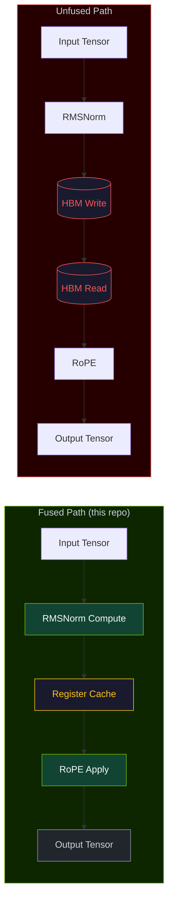
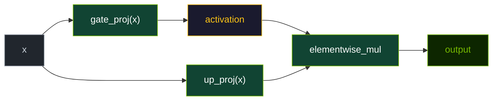
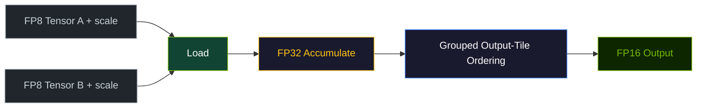

# Kernel Design

This page explains the main implementation ideas used by the repository's Triton kernels. These ideas are grounded in the Triton compiler model [1] and the IO-aware fusion philosophy pioneered by FlashAttention [2].

## `fused_rmsnorm_rope`

The central idea is to keep the normalized values in registers long enough to apply RoPE before writing the final output.

Design goals:

- compute RMS statistics per row,
- apply the weight scale,
- immediately rotate the head pairs,
- write only the final tensor.

Why it matters:

- the unfused path would typically materialize an intermediate normalized tensor,
- the fused path avoids that extra global-memory traffic.

### Data-flow comparison



> **Figure 3.** Fused vs. unfused data flow. The unfused path incurs two extra HBM round-trips (red) for the intermediate normalized tensor. The fused path keeps values in registers (yellow) between RMSNorm and RoPE.

## `fused_gated_mlp`

The kernel computes two projections for the same input tile:

- gate projection,
- up projection.

It then applies the selected activation to the gate projection and multiplies it with the up projection result:

```text
output = activation(gate_proj(x)) * up_proj(x)
```

This combines projection and activation work in one launch instead of splitting them across separate operations.

### Data flow



> **Figure 4.** Gated MLP data flow. Both projections consume the same input tile in one kernel launch. The activation and elementwise multiply are also fused into the same execution unit.

## `fp8_gemm`

The GEMM kernel works with the repository's FP8 compatibility representation:

- values stored in `uint8`,
- explicit scales loaded from scalar tensors,
- FP32 accumulation,
- half-precision output path.

The code also uses grouped output-tile ordering to improve cache locality.

### Data flow



> **Figure 5.** FP8 GEMM data flow. Quantized values are loaded with their scales, accumulated in FP32, and reordered via grouped output tiles (blue) to improve cache locality before the final FP16 write.

## Tiling heuristics

The current launchers choose block sizes heuristically from problem dimensions rather than from online autotuning during each call.

Examples:

- larger tiles for larger GEMMs,
- smaller `BLOCK_K` when the reduction dimension is smaller,
- simple fixed tile choices in the current fused Gated MLP path.

This keeps the runtime path predictable and small, while leaving more elaborate search to the generic autotuner tools.

## Reference implementations matter

Each kernel module also carries a reference implementation in plain PyTorch. Those references are important because they provide:

- correctness comparisons,
- a readable mathematical baseline,
- benchmark verification inputs.

The design philosophy is not just speed, but speed with a local verification path.

## References

1. Tillet, P., Kung, H. T., & Cox, D. (2019). Triton: An Intermediate Language and Compiler for Tiled Neural Network Computations. *WMAS@ASPLOS*. [arXiv:1908.04767](https://arxiv.org/abs/1908.04767)
2. Dao, T., et al. (2022). FlashAttention: Fast and Memory-Efficient Exact Attention with IO-Awareness. *NeurIPS*. [arXiv:2205.14135](https://arxiv.org/abs/2205.14135)
3. Zhang, B., & Sennrich, R. (2019). Root Mean Square Layer Normalization. *NeurIPS*. [arXiv:1910.07467](https://arxiv.org/abs/1910.07467)
4. Su, J., et al. (2021). RoFormer: Enhanced Transformer with Rotary Position Embedding. *arXiv preprint*. [arXiv:2104.09864](https://arxiv.org/abs/2104.09864)

See the full [References](/en/references/papers) page for more papers and [Projects](/en/references/projects) for related open-source work.
