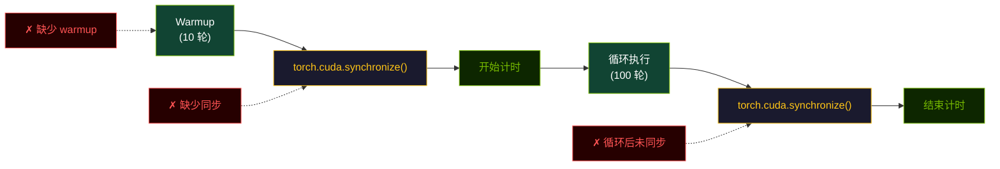

# 性能优化

本页说明如何正确测量仓库中的 kernel，以及怎样理解这些性能结果。融合优化思想借鉴了 FlashAttention [1] 的 IO-aware 调度原则。

## 先明确你在测什么

仓库里的三类性能故事并不完全一样：

- `fused_rmsnorm_rope`：更偏向减少内存往返，
- `fused_gated_mlp`：更偏向融合后减少 launch 与中间结果搬运，
- `fp8_gemm`：更偏向量化与矩阵乘吞吐量。

测量和解释时不要把它们混成同一种优化问题。

## 正确计时方式

```python
import time
import torch
from triton_ops import fused_rmsnorm_rope

x = torch.randn(8, 2048, 4096, device="cuda", dtype=torch.float16)
weight = torch.ones(4096, device="cuda", dtype=torch.float16)
cos = torch.randn(2048, 64, device="cuda", dtype=torch.float16)
sin = torch.randn(2048, 64, device="cuda", dtype=torch.float16)

for _ in range(10):
    _ = fused_rmsnorm_rope(x, weight, cos, sin)
torch.cuda.synchronize()

start = time.perf_counter()
for _ in range(100):
    _ = fused_rmsnorm_rope(x, weight, cos, sin)
torch.cuda.synchronize()
end = time.perf_counter()

print((end - start) / 100 * 1000)
```

必须包含：

- warmup，
- 计时前后的显式同步，
- 来自真实模型的代表性形状。

### 计时流程图



> **图 6.** 正确的 GPU 计时流程。Warmup（绿色）预热缓存和 kernel。同步（黄色）在测量区域前后都是必须的。常见错误（红色）会导致计时结果无效。

## 优先复用内置 benchmark 层

`BenchmarkSuite` 已经封装了 warmup、重复执行、正确性校验和报告生成。如果你要做多轮实验对比，优先用它。

## 如何理解指标

仓库使用 `PerformanceProfile` 计算派生指标：

```python
from triton_ops import PerformanceProfile

# GEMM 类路径的计算吞吐
gemm_profile = PerformanceProfile.gemm(M=1024, N=4096, K=4096)
metrics = gemm_profile.metrics(latency_ms=0.5)
print(f"吞吐量: {metrics.throughput_tflops:.2f} TFLOPS")

# Elementwise / reduction 类路径的有效带宽
elem_profile = PerformanceProfile.elementwise(numel=1024*4096)
metrics = elem_profile.metrics(latency_ms=0.1)
print(f"带宽利用率: {metrics.bandwidth_utilization:.1f}%")
```

这有助于区分：

- GEMM 类路径的计算吞吐，
- elementwise / reduction 类路径的有效带宽。

## 自定义 kernel 的调优

`TritonAutoTuner` 适合你自己写了 kernel wrapper，想在这些维度上搜索：

- block 大小，
- warp 数，
- 其他以关键字参数传入的 launch 配置。

仓库导出的 kernel 入口函数在正常调用时不会自动做在线配置搜索。

## 实际排查清单

### 对 `fused_rmsnorm_rope`

- 检查 RoPE cache 形状是否正确且 contiguous，
- 确保 hidden dimension 与 head 布局匹配，
- 把主要优化目标理解为内存流量削减。

### 对 `fused_gated_mlp`

- 用真实 intermediate dimension 做 benchmark，
- 明确区分 `silu` 与 `gelu`，
- 记住完整 FFN 还包含 kernel 外部的额外计算。

### 对 `fp8_gemm`

- 对比自动量化与显式预量化两种路径，
- 一定要与 FP16 baseline 做数值误差比较，
- 不要只测方阵，也要覆盖真实的长宽比。

## 哪些结果不能盲信

- 单一 GPU 上的结果，不能直接外推到所有硬件。
- 没有同步的 benchmark 结果基本没有意义。
- 单 kernel 的提速，不等于端到端模型同样幅度的提速。

## 参考文献

1. Dao, T., et al. (2022). FlashAttention: Fast and Memory-Efficient Exact Attention with IO-Awareness. *NeurIPS*. [arXiv:2205.14135](https://arxiv.org/abs/2205.14135)
2. Williams, S., Waterman, A., & Patterson, D. (2009). Roofline: An Insightful Visual Performance Model for Floating-Point Programs and Multicore Architectures. *Communications of the ACM*.

详见完整 [参考文献](/zh/references/papers) 页面与 [性能可视化](/zh/guides/benchmark-visualization) 图表。
