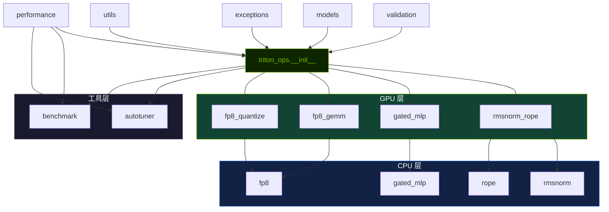

# 架构设计

仓库整体围绕一个小而清晰的公开 API 层构建，下面连接输入校验、Triton kernel 实现、性能工具层和共享数据模型。

## 模块地图

```text
triton_ops/
├── __init__.py          # 根包公开导出
├── performance.py       # PerformanceProfile — 派生指标统一接口
├── models.py            # dataclass 与指标/结果容器
├── exceptions.py        # 自定义异常类型
├── validation.py        # 运行时输入校验
├── utils.py             # 公共 helper 与常量
├── kernels/
│   ├── rmsnorm_rope.py
│   ├── gated_mlp.py
│   ├── fp8_gemm.py
│   └── fp8_quantize.py
├── compute/             # 纯 NumPy CPU 参考实现
│   ├── rmsnorm.py
│   ├── rope.py
│   ├── gated_mlp.py
│   └── fp8.py
├── autotuner/
│   ├── configs.py
│   ├── tuner.py
│   └── cache.py
└── benchmark/
    ├── correctness.py
    ├── report.py
    └── suite.py
```

## 模块依赖关系图



> **图 1.** 模块依赖关系图。GPU 层 kernel（绿色）依赖 CPU 层参考实现（蓝色）进行正确性验证。工具层（灰色）独立消费 `performance` 指标。

## 调用链路


> **图 2.** 运行时调用链路。验证层（黄色）在任何 GPU 工作启动前充当 gate。Triton kernel 仅在边界处读写 HBM。

## 职责拆分

### 公开 API 层

`triton_ops.__init__` 是唯一的用户入口，导出 kernel、模块封装、量化 helper、benchmark 类、自动调优工具、dataclass、异常类型，以及 `PerformanceProfile`。

### 性能指标接口层

`triton_ops.performance` 提供 `PerformanceProfile` 对象，封装问题形状上下文，用于计算派生指标（吞吐量 TFLOPS、带宽 GB/s、利用率）。供 `BenchmarkSuite` 和自动调优器使用。

三种构造器：`latency_only()`、`elementwise(numel, ...)`、`gemm(M, N, K, ...)`。

### 计算参考层

`triton_ops.compute` 提供与 Triton kernel 数学等价的纯 NumPy 实现，无需 GPU 即可运行：

- 作为 kernel 正确性验证的参考实现，
- 作为无 GPU 环境下的单元测试目标，
- 作为精确数学公式的文档说明。

### 校验层

`validation.py` 统一管理输入契约：

- device 放置，
- dtype 支持，
- contiguous 要求，
- shape 兼容性，
- 标量参数检查。

这样 kernel 入口就不用重复写大量样板校验逻辑，测试和 wrapper 也能复用同一套规则。

### Kernel 层

`kernels/` 中放的是 Triton 实现，以及用于正确性对照的 PyTorch reference 实现。

每个 kernel 模块通常包含：

- Triton kernel 本体，
- 用户可调用的 Python launcher，
- reference 函数，
- 可选的 `nn.Module` 封装。

### 支撑工具层

自动调优和 benchmark 都独立于 kernel 运行路径存在。它们的目标是帮助实验、验证和报告，而不是把所有调优逻辑都隐式塞进每次 API 调用里。

## 架构意图

这个结构偏向于：

- 显式的运行契约，
- 可验证的 reference 路径，
- 小而明确的导出原语集合，
- 可独立复用的支持代码。

## 关键边界

- 仓库不提供完整的 Transformer 模型栈。
- 这些融合算子更适合作为更大推理系统中的原语组件。
- benchmark 和 autotuning 是伴随工具层，而不是必须进入正常运行路径的中间层。
