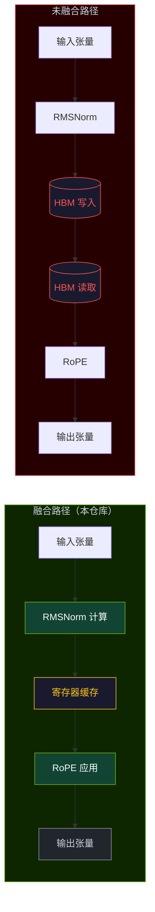
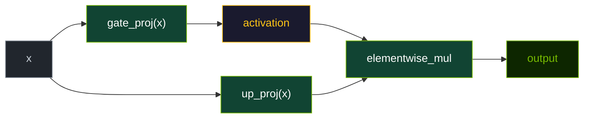
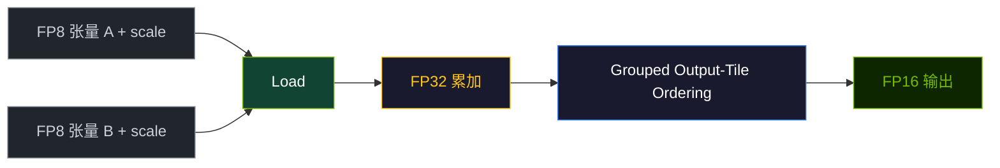

# 算子设计

本页解释仓库 Triton kernel 的主要实现思路。这些想法基于 Triton 编译器模型 [1] 和 FlashAttention [2] 开创的 IO-aware 融合思想。

## `fused_rmsnorm_rope`

核心思路是：在寄存器里尽量保留归一化结果，紧接着完成 RoPE，再把最终输出写回。

设计目标：

- 逐行计算 RMS 统计量，
- 乘上 RMSNorm 权重，
- 立刻按 head pair 做旋转，
- 只写最终输出，不写中间张量。

为什么重要：

- 未融合路径通常会先把归一化中间结果写回全局显存，
- 融合路径可以避免这一步额外的 HBM 往返。

### 数据流对比



> **图 3.** 融合与未融合数据流对比。未融合路径需要两次额外的 HBM 往返（红色）来搬运中间归一化张量。融合路径在 RMSNorm 与 RoPE 之间将值保留在寄存器中（黄色）。

## `fused_gated_mlp`

这个 kernel 会对同一块输入同时计算两条投影：

- gate projection，
- up projection。

随后对 gate projection 施加激活，并与 up projection 相乘：

```text
output = activation(gate_proj(x)) * up_proj(x)
```

这样就把投影与激活的工作收敛到一次 launch 中，而不是拆成多个操作。

### 数据流



> **图 4.** Gated MLP 数据流。两条投影在同一次 kernel launch 中消费同一块输入 tile。激活函数与逐元素相乘也被融合到同一个执行单元中。

## `fp8_gemm`

GEMM kernel 使用的是仓库自定义的 FP8 兼容表示：

- 数据以 `uint8` 存储，
- scale 来自显式标量张量，
- 用 FP32 做累加，
- 输出走半精度路径。

代码里还采用了 grouped output tile 排布，以改善 cache locality。

### 数据流



> **图 5.** FP8 GEMM 数据流。量化值与其 scale 一同加载，在 FP32 中累加，并通过 grouped output tile（蓝色）重排序以改善 cache locality，最终写入 FP16。

## 分块启发式

当前 Python launcher 主要根据问题规模做启发式 block 选择，而不是每次调用时在线自动调优。

例如：

- 大矩阵选择更大的 tile，
- 当 reduction 维度较小时选择更小的 `BLOCK_K`，
- Gated MLP 当前实现使用较固定的 tile 参数。

这样做的好处是运行路径更小、更稳定，而更复杂的配置搜索则交给通用 autotuner 层。

## 为什么 reference 实现很重要

每个 kernel 模块都同时保留了 PyTorch reference 实现，这很关键，因为它提供了：

- 正确性对照基线，
- 更容易阅读的数学实现，
- benchmark 验证所需的参考输出。

仓库强调的不只是"快"，而是"可验证地快"。

## 参考文献

1. Tillet, P., Kung, H. T., & Cox, D. (2019). Triton: An Intermediate Language and Compiler for Tiled Neural Network Computations. *WMAS@ASPLOS*. [arXiv:1908.04767](https://arxiv.org/abs/1908.04767)
2. Dao, T., et al. (2022). FlashAttention: Fast and Memory-Efficient Exact Attention with IO-Awareness. *NeurIPS*. [arXiv:2205.14135](https://arxiv.org/abs/2205.14135)
3. Zhang, B., & Sennrich, R. (2019). Root Mean Square Layer Normalization. *NeurIPS*. [arXiv:1910.07467](https://arxiv.org/abs/1910.07467)
4. Su, J., et al. (2021). RoFormer: Enhanced Transformer with Rotary Position Embedding. *arXiv preprint*. [arXiv:2104.09864](https://arxiv.org/abs/2104.09864)

详见完整 [论文](/zh/references/papers) 页面与相关 [开源项目](/zh/references/projects)。
