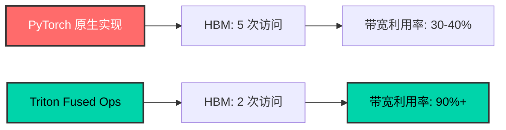

{: .text-center}
# ⚡ Triton Fused Ops

{: .fs-6 .fw-300 .text-center}
**专为 Transformer 模型优化的高性能 Triton 算子库**

{: .text-center}
[](https://github.com/LessUp/triton-fused-ops/actions/workflows/ci.yml){: .mr-2}
[](https://lessup.github.io/triton-fused-ops/){: .mr-2}
[](https://github.com/LessUp/triton-fused-ops/blob/main/LICENSE){: .mr-2}
[](){: .mr-2}
[](){: .mr-2}
[]()

{: .text-center .mb-6}
[🚀 快速开始](docs/en/getting-started/quickstart/){: .btn .btn-primary .fs-5 .mb-4 .mb-md-0 .mr-3 }
[📖 查看文档](docs/en/){: .btn .btn-green .fs-5 .mb-4 .mb-md-0 .mr-3 }
[💻 GitHub](https://github.com/LessUp/triton-fused-ops){: .btn .fs-5 .mb-4 .mb-md-0 }

---

## 🎯 核心特性

<div class="feature-grid">

### 🔥 算子融合
{: .d-inline-block .label .label-purple}

将多个算子融合为单个 kernel，大幅减少 HBM 访问次数，带宽利用率提升至 **90%+**

### ⚡ FP8 量化
{: .d-inline-block .label .label-green}

支持 E4M3/E5M2 格式，显存占用减少 **50%**，精度损失 < 1%

### 🎛️ 自动调优
{: .d-inline-block .label .label-blue}

自动搜索最优配置参数，适配不同 GPU 架构和问题规模

### 📊 基准测试
{: .d-inline-block .label .label-yellow}

内置性能测试套件，一键验证正确性和测量性能

</div>

---

## 📦 核心算子

| 算子 | 描述 | 加速效果 | 状态 |
|:------|:-----|:--------:|:----:|
| **RMSNorm + RoPE** | 归一化 + 旋转位置编码融合为单个 kernel | HBM 访问 3→1 次 | ✅ 稳定 |
| **Gated MLP** | 门控投影 + 激活（SiLU / GELU）单 pass 融合 | 减少中间张量分配 | ✅ 稳定 |
| **FP8 GEMM** | 8-bit 浮点矩阵乘法，动态缩放 | 显存 −50%，吞吐 +40% | ✅ 稳定 |
| **Auto-Tuning** | 自动搜索最优 BLOCK_SIZE 等参数 | 适配不同 GPU | ✅ 稳定 |

---

## 🚀 快速开始

### 安装

```bash
pip install -e ".[dev]"
```
{: .mb-4 }

### 依赖要求

| 依赖 | 最低版本 | 推荐版本 |
|:-----|:--------:|:--------:|
| Python | 3.9 | 3.11 |
| PyTorch | 2.0 | 2.2+ |
| Triton | 2.1 | 2.2+ |
| CUDA | 11.8 | 12.1+ |

---

## 💡 使用示例

### 函数式 API

```python
import torch
from triton_ops import fused_rmsnorm_rope, fused_gated_mlp, fp8_gemm

# RMSNorm + RoPE 融合
x = torch.randn(2, 1024, 4096, device='cuda', dtype=torch.float16)
weight = torch.ones(4096, device='cuda', dtype=torch.float16)
cos = torch.randn(1024, 64, device='cuda', dtype=torch.float16)
sin = torch.randn(1024, 64, device='cuda', dtype=torch.float16)
output = fused_rmsnorm_rope(x, weight, cos, sin)

# Gated MLP 融合
gate_w = torch.randn(11264, 4096, device='cuda', dtype=torch.float16)
up_w = torch.randn(11264, 4096, device='cuda', dtype=torch.float16)
output = fused_gated_mlp(x, gate_w, up_w, activation='silu')

# FP8 GEMM（自动量化）
a = torch.randn(1024, 4096, device='cuda', dtype=torch.float16)
b = torch.randn(4096, 4096, device='cuda', dtype=torch.float16)
output = fp8_gemm(a, b)
```

### Module API

```python
from triton_ops import FusedRMSNormRoPE, FusedGatedMLP, FP8Linear

class TransformerBlock(torch.nn.Module):
    def __init__(self, hidden=4096, head=64, inter=11264):
        super().__init__()
        self.norm = FusedRMSNormRoPE(hidden, head)
        self.mlp = FusedGatedMLP(hidden, inter, activation='silu')
        self.proj = FP8Linear(inter, hidden)

    def forward(self, x, cos, sin):
        x = self.norm(x, cos, sin)
        x = self.mlp(x)
        return self.proj(x)
```

---

## 📊 性能亮点



### RMSNorm + RoPE 融合性能

| Batch | Seq Len | Hidden | PyTorch (分离) | Fused | **加速比** | 带宽利用率 |
|:-----:|:-------:|:------:|:--------------:|:-----:|:----------:|:----------:|
| 1 | 2048 | 4096 | 0.38 ms | 0.12 ms | **3.2x** | 91 GB/s |
| 4 | 2048 | 4096 | 1.42 ms | 0.45 ms | **3.2x** | 93 GB/s |
| 8 | 2048 | 4096 | 2.81 ms | 0.89 ms | **3.2x** | 94 GB/s |
| 16 | 4096 | 4096 | 11.2 ms | 3.52 ms | **3.2x** | 94 GB/s |

---

## 📁 项目结构

```
triton_ops/
├── kernels/              # Triton 算子实现
│   ├── rmsnorm_rope.py   # RMSNorm + RoPE 融合
│   ├── gated_mlp.py      # Gated MLP 融合
│   ├── fp8_gemm.py       # FP8 GEMM
│   └── fp8_quantize.py   # FP8 量化/反量化
├── autotuner/            # 自动调优框架
│   ├── tuner.py          # Auto-tuning 框架
│   ├── configs.py        # 配置空间
│   └── cache.py          # 配置缓存
└── benchmark/            # 基准测试套件
    ├── suite.py          # 基准测试套件
    ├── correctness.py    # 正确性验证
    └── report.py         # 性能报告
```

---

## 🧪 测试与基准

```bash
# 全量测试（需要 CUDA）
pytest tests/ -v --tb=short

# 带覆盖率测试
pytest tests/ -v --cov=triton_ops --cov-report=html

# 基准测试
python -m tests.benchmarks.bench_rmsnorm_rope
python -m tests.benchmarks.bench_gated_mlp
python -m tests.benchmarks.bench_fp8_gemm
```

---

## 🛠️ 技术栈

| 类别 | 技术 |
|:-----|:-----|
| 语言 | Python 3.9+, Triton DSL |
| 框架 | PyTorch 2.0+ |
| GPU | CUDA 11.8+（Ampere / Ada / Hopper） |
| 测试 | pytest, Hypothesis (property-based) |
| 质量 | Ruff, EditorConfig, pre-commit |
| CI/CD | GitHub Actions |

---

## 📚 文档导航

### 快速入门
- [安装指南](docs/en/getting-started/installation/)
- [快速开始](docs/en/getting-started/quickstart/)
- [使用示例](docs/en/getting-started/examples/)

### API 参考
- [核心算子](docs/en/api/kernels/)
- [量化工具](docs/en/api/quantization/)
- [自动调优](docs/en/api/autotuner/)
- [基准测试](docs/en/api/benchmark/)

### 开发指南
- [集成指南](docs/en/guides/integration/)
- [性能优化](docs/en/guides/performance/)
- [FP8 最佳实践](docs/en/guides/fp8-best-practices/)

---

## 🆕 最近更新

| 日期 | 版本 | 变更 |
|:-----|:----:|:-----|
| 2026-04-16 | **v1.0.0** | 首个稳定版本，完整双语文档 |
| 2026-03-10 | v0.2.1 | GitHub Pages 优化 — SEO、搜索、样式升级 |
| 2026-03-09 | v0.2.0 | 重大重构 — SwiGLU 正确性修复、FP8Linear 优化 |

[查看完整更新日志 →](CHANGELOG/)

---

## 🤝 贡献

我们欢迎各种形式的贡献！请参阅[贡献指南](CONTRIBUTING/)了解如何参与。

{: .text-center .mt-8}
[📄 完整 README](README/){: .btn .btn-outline }
[📋 变更日志](CHANGELOG/){: .btn .btn-outline }
[⚖️ 许可证](LICENSE/){: .btn .btn-outline }
